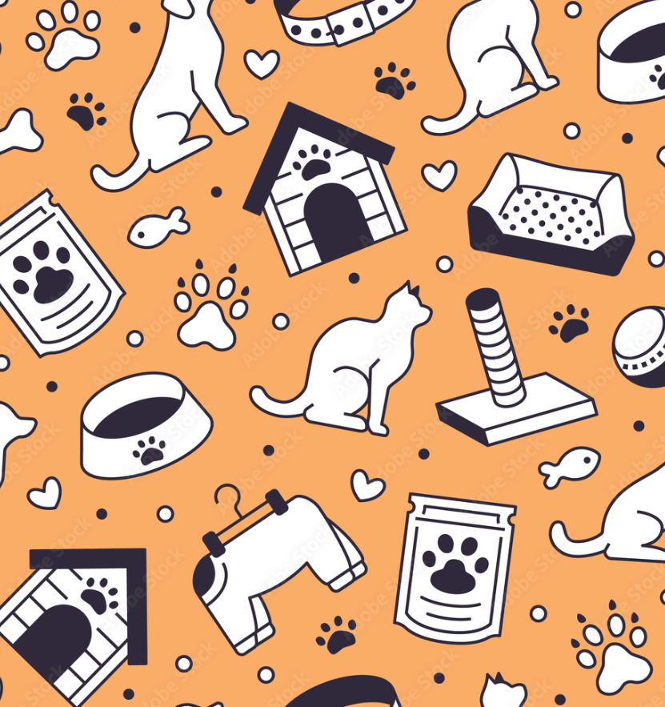

## [Linkedin](https://www.linkedin.com/in/jeduardosleite/)

  

# Projeto

Este projeto consiste no desenvolvimento de um dashboard de Business Intelligence (BI) para um petshop fictício chamado Gatito.
O objetivo foi criar uma visualização clara e interativa dos dados de faturamento e desempenho, permitindo análises rápidas e apoio à tomada de decisão.

Durante o desenvolvimento, foquei em organização visual, interatividade e clareza das informações, utilizando recursos do Power BI.

---

# Objetivos do Dashboard
Apresentar o faturamento do petshop
Permitir análise ao longo do tempo
Criar visualizações intuitivas e interativas
Melhorar a experiência visual utilizando cores e layout adequados

Durante o projeto, foram utilizados os seguintes elementos visuais e ferramentas:
- Gráfico de Barras — comparação entre categorias
- Gráfico de Linha — análise de tendências ao longo do tempo
- Gráfico de Pizza — distribuição proporcional de dados
- Cartões (Cards) — exibição de indicadores principais
- Text Filter — filtro textual para busca dinâmica
- Image Grid — exibição visual de imagens relacionadas
- Slicer de Data — seleção de períodos específicos

---

# Aprendizados

Durante o desenvolvimento deste projeto, aprendi:

- Criar diferentes tipos de gráficos no Power BI (barra, linha, pizza e cartão)
- Utilizar filtros interativos (Text Filter e Slicer)
- Criar medidas utilizando **DAX**
- Construir cálculo de **faturamento**
- Utilizar **Power Query** para tratamento e organização dos dados
- Trabalhar com elementos visuais adicionais, como **Image Grid**
- Melhorar a estética e organização visual utilizando cores
- Criar dashboards mais intuitivos e interativos
---

# Ferramentas Utilizadas
- **Power BI**
- **Power Query** (tratamento de dados)
- **DAX (Data Analysis Expressions)**
